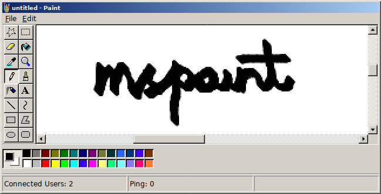

<div align="center">
    <a href="http://mspaint.us/">
        
    </a>
    <br>
</div>
<br>
<p align="center">
    
    
    
    
    
    
</p>
<br>

 * complete realtime support
 * classic mspaint tools
 * public domain

##  what

There are many mspaint clones on the web, of varying levels of completeness.

In this implementation, everyone shares the same canvas. Pixel drawing, UI updates, mouse events or similar are displayed to everyone in realtime.

The style is based on win98 paint, except the icon. I prefer the other icon.

## implementation notes

A main focus has been to be fast and lean. Keeping the script payload low, using vector art where possible, reducing traffic required. Canvas drawing operations particularly seem to require optimizations for decent speed.

### ⚡️ initial render

Providing the state of the canvas to the user quickly to reduce the time to first paint has been the subject of much thought. Sending a raw Uint8ClampedArray down the wire after getting a websocket connection just seemed way too slow.

The canvas is rendered serverside with [node-canvas](https://github.com/Automattic/node-canvas). This can produce PNGs, so I set up a route for accessing the current state as a PNG.

So, this is embedded in the initial markup as an `` tag and is copied to the canvas when finished. This means that the data can be loaded async before any scripts are reached.

I tried applying lossless compression to the image before sending it, but this seems to take more time than is saved by reducing the image size. This could be cached instead, but the state would be out of date. It feels like there are endless tradeoffs to consider.

### 🖌️ shared UI

The fragments of user UI seen in the workspace are generated from a nonstandard virtual DOM representation and are shared as an initial state then patched. This is then rendered using [Preact](https://github.com/developit/preact).

All of the code for interacting with the canvas and virtual DOM is shared between front and backend.

### 📡 networking

Initially communication between client and server was done via JSON strings, which seemed quite wasteful. Using something like msgpack or protobuf would improve this, but would incur a significant bundle size penalty. Therefore, a [custom format](https://github.com/kirjavascript/mspaint/blob/master/shared/crush.js) has been created.

A notable detail is that property names or enums are all preindexed and reduced to single bytes.

This method of packing / unpacking of data is much slower than JSON, but gives a huge reduction in data size.

### 🖥️ browsers

This project seems to work in most browsers, mobile even has multitouch support. Older browsers need to download a polyfill and incur a performance hit, newer ones can skip it. [Open an issue](https://github.com/kirjavascript/mspaint/issues/new) if it's broken anywhere.

For the scrollbars, I could not find a universal solution for styling them natively, so ended up rolling my own. This was pretty awful to do - d3's d3-scale module would have added 63kb to the final bundle size (why doesn't tree shaking work properly in webpack 2?), so I went without it.

## directory tree

    ├── development/     - development tools
    │
    ├── server/          - backend code
    │   └── index.js     - base script
    │
    ├── shared/          - universal code
    │   ├── canvas/      - canvas drawing
    │   ├── vdom/        - virtual DOM
    │   └── constants.js - configuration
    │
    └── web/             - frontend code
        ├── bundles/     - transpiled modules
        ├── modules/     - scripts and styles
        ├── static/      - other assets
        └── root.js      - entrypoint

## potential ideas

 * multiple rooms
 * nicknames / better multiplay
 * canvas history


## related links

 * [mspaint.us/canvas.png](http://mspaint.us/canvas.png) a PNG of the current canvas
 * [jspaint](https://github.com/1j01/jspaint) similar project
 * [virtual x86](http://copy.sh/v86/?profile=windows98) for quick testing
 * [kbd_mspaint](http://www.rcramer.com/tech/windows/kbd_mspaint.shtml) keyboard documentation
 * [easyfilter](http://members.chello.at/~easyfilter/bresenham.html) line drawing algorithm
<!--
```
    TODO;
    open/new/save = list/newroom/png
    multiple pages /thing = different thing
    save history (diff/save anyway)
    room owner / admin menu
    nick
    drag an image on
    fix font
    native colour picker
    directory
    contributors list
    tool specific cursors
    clipboard
    link github - about
    print
    licenced to everyone
    ssl

https://github.com/1j01/jspaint/blob/gh-pages/src/image-manipulation.js
```

add routes for badges to show active users
https://github.com/github/markup/issues/224
node shrinkray for compression
cmd.exe chat - mouse is colournames
view bitmap - do fullscreen

mouse wheel
ncrease array limit from 255-65535 (write helper)
-->

## licence

<a rel="license" href="http://creativecommons.org/publicdomain/zero/1.0/">
    
</a>

To the extent possible under law, all copyright and related or neighboring rights to mspaint have been waived.
