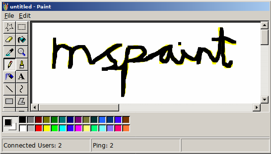

<div align="center">
    
</div>

 * complete realtime support
 * public domain
 * classic mspaint tools
 * virtual DOM
 * server side rendering

<div align="center">
    
    
    
    
</div>
## what

There are many mspaint clones on the web, of varying levels of completeness.

This is my implementation; everyone shares the same workspace, and canvas interactions, UI updates, mouse events or similar are displayed to everyone as they happen.

This has presented various technical challenges. I'm not aware of any desyncing, but I can't really know for sure.

The style is based on win98 paint, except the icon. I prefer the other icon.

## implementation notes

A focus has been made on keeping everything fast and lean. Keeping the script payload low, using vector art where possible, reducing traffic required.

Providing the state of the canvas to the user quickly to reduce the time to first paint has been the subject of much thought. Sending a raw Uint8ClampedArray down the wire after getting a websocket connection just seemed way too slow.

The canvas is rendered serverside with [node-canvas](https://github.com/Automattic/node-canvas). This can produce PNGs, so I set up a route for accessing the current state as a PNG.

So, this is embedded in the initial markup as an `` tag and is copied to the canvas when finished. This means that the data can be loaded async before any scripts are reached.

I tried applying lossless compression to the image before sending it, but this seems to take more time than is saved by reducing the image size. This could be cached instead, but the state would be out of date.

PNG is a great database format for storing pixels; the canvas is periodically saved to disk to restore the state on server restart.

The fragments of user UI seen in the workspace are generated from a nonstandard virtual DOM representation that is shared between everyone. This is rendered using [preact](https://github.com/developit/preact). Preact was chosen for its tiny size and the fact that it seemed to perform better than my [d3](https://d3js.org/) renderer.

All of the code for interacting with the canvas and virtual DOM is shared between front and backend.

Initially communication between client and server was done via JSON strings, which seemed quite wasteful. Using something like msgpack or protobuf would improve this, but would incur a significant bundle size penalty. Therefore, a [custom format](https://github.com/kirjavascript/mspaint/blob/master/shared/crush.js) has been created.

One advantage of this is that property names or enums can be preindexed and reduced to single bytes.

Strings now take up half the space they would otherwise, numbers are more interesting. Treating numbers like strings is best a lot of the time, but the IEEE754 representation works better for numbers that tend to be larger. Both methods have been implemented.

This gives a huge improvement in reducing the overall traffic required for communication.

For the scrollbars, I could not find a universal solution for styling them natively, so ended up rolling my own. This was pretty awful to do - d3's d3-scale module would have added 63kb to the final bundle size (why doesn't tree shaking work properly in webpack 2?), so I went without it.

This project should work nearly everywhere, including mobile. Older browsers are made to download a polyfill and incur a performance hit. [Please open an issue](https://github.com/kirjavascript/mspaint/issues/new) if it's broken anywhere.

## directory tree

    ├── server/          - backend code
    │   └── index.js     - base script
    │
    ├── shared/          - universal code
    │   ├── canvas/      - canvas drawing
    │   ├── vdom/        - virtual DOM
    │   └── constants.js - configuration
    │
    └── web/             - frontend code
        ├── bundles/     - transpiled modules
        ├── modules/     - scripts and styles
        ├── static/      - other assets
        └── root.js      - entrypoint

## TODO (maybe)

 * Support multiple rooms
 * Add nicknames
 * Save canvas history

### related links

 * [mspaint.us/canvas.png](http://mspaint.us/canvas.png) a PNG of the current canvas
 * [jspaint](https://github.com/1j01/jspaint) similar project
 * [virtual x86](http://copy.sh/v86/?profile=windows98) for quick testing
 * [kbd_mspaint](http://www.rcramer.com/tech/windows/kbd_mspaint.shtml) keyboard documentation
 * [easyfilter](http://members.chello.at/~easyfilter/bresenham.html) line drawing algorithm
<!--
```
    TODO;
    open/new/save = list/newroom/png
    multiple pages /thing = different thing
    save history (diff/save anyway)
    room owner / admin menu
    nick
    drag an image on
    fix font
    native colour picker
    directory
    contributors list
    tool specific cursors
    clipboard
    link github - about

https://github.com/1j01/jspaint/blob/gh-pages/src/image-manipulation.js
```

increase array limit from 255-65535 (write helper)

zoom vdom bug
DOM_PLACE

babel-register

// console.log(require('babel-core')
//     .transformFileSync('./shared/vdom/render-preact.js', {
//         presets: ['es2015', 'stage-0'],
//         plugins: [['transform-react-jsx', { pragma: 'h' }]],
//     }).code);
-->
